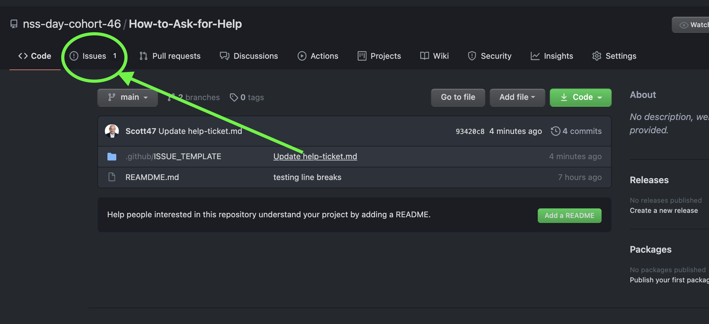
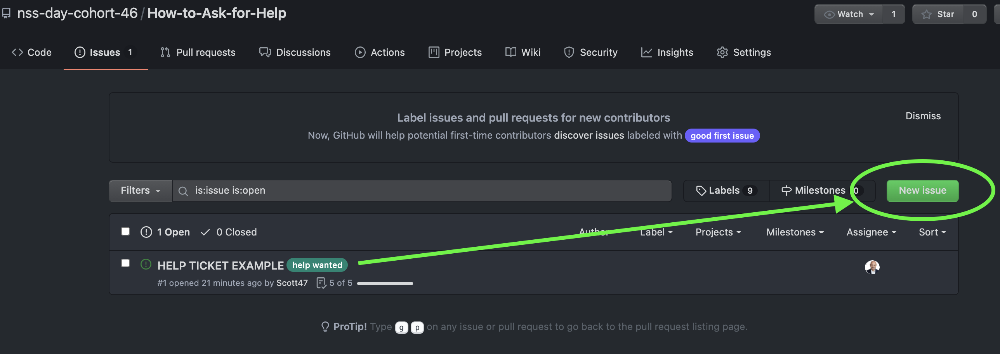
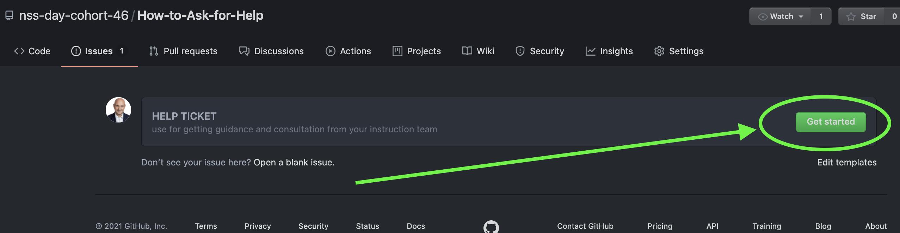
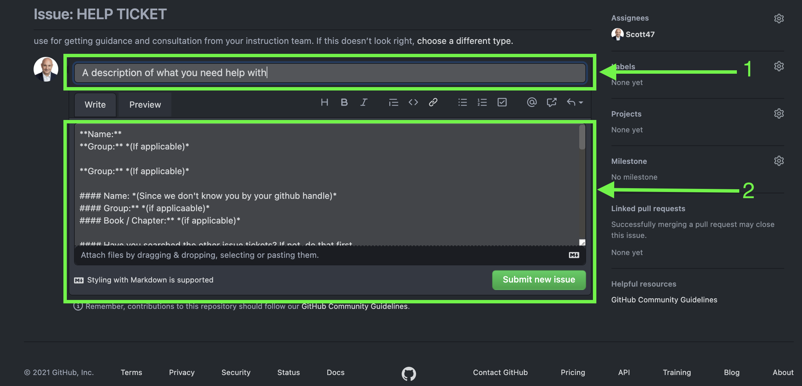
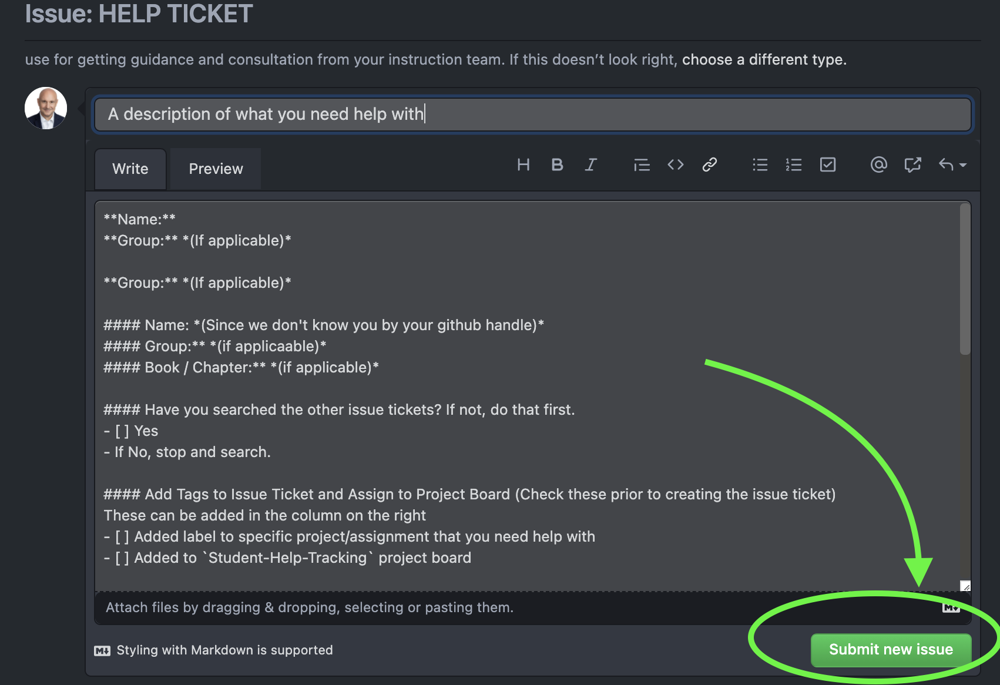

# c46 Developer Help Repo

This repository will be used to help instructors and students help each other with coding questions.

One of the most important skills for a software developer is formulating good questions. When you work to articulate the issue, you gain a better understanding of what problem you are trying solve, making you better equipped to interact with senior developers at work and to facilitate your own learning. 

We want you to be able to effectively articulate problems you encounter in your code using correct vocabulary and accurately describe the output you expect, the output you are getting, solutions you've tried, and what ultimately resolved the issue.

You will also get more familiar with github and markdown. Click [here](https://github.com/adam-p/markdown-here/wiki/Markdown-Cheatsheet) for a reference to markdown syntax.

## How to ask for help

Follow the steps below to create an issue ticket.
### Step 1

1. Navigate to issues
1. Check both open and closed issues to see if someone else already had your issue

> 

### Step 2
Click "New Issue"

> 

### Step 3
Click "Get Started" on the Template you would like to use

> 

### Step 4
1. Add a description of what you need help with in the **Title**
1. Update details as outlined in the template

> 

#### Step 5
Click "Submit new issue"
> 

#### Step 6
1. Continue searching for a solution to your issue **(If you find a solution, add a comment with your solution then remove the help wanted tag and add issue resolved)**
1. See if you can help another classmate

